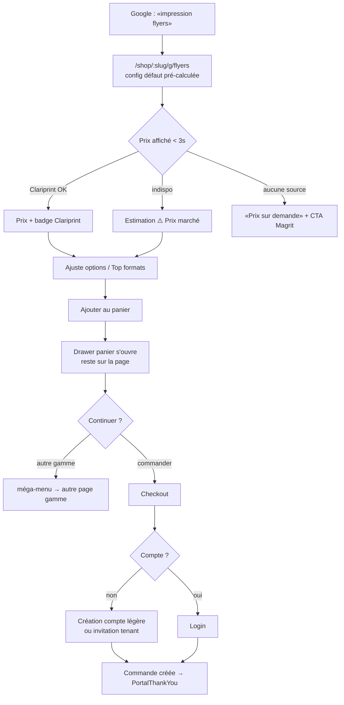
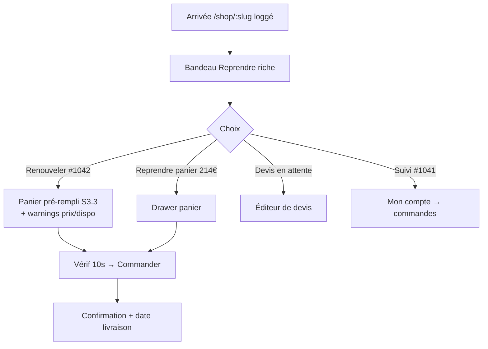
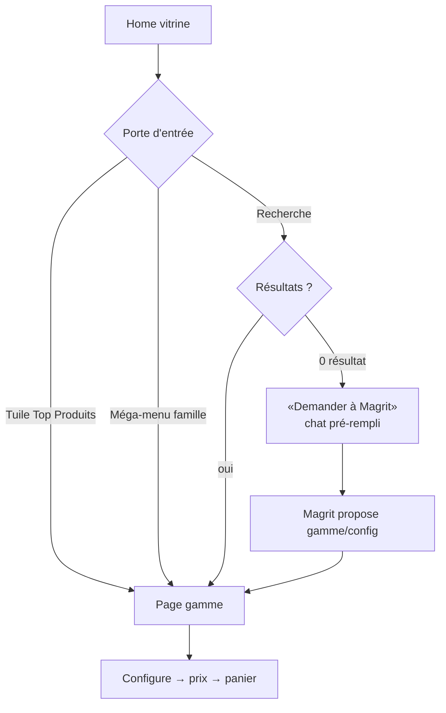

# UX Design Specification Magrit — Gabarit boutique v2 (aligné Printoclock)

**Author:** Arnaud
**Date:** 2026-07-24

---

<!-- UX design content will be appended sequentially through collaborative workflow steps -->

## Executive Summary

### Project Vision

Gabarit boutique v2 « e-commerce web-to-print standard » aligné sur la structure
Printoclock (référence factuelle : [analyse-printoclock-gabarit-boutique-2026-07-24.md](analyse-printoclock-gabarit-boutique-2026-07-24.md)) :
méga-menu par familles dérivé du PIM, home vitrine catalogue, page gamme dédiée
avec configurateur inline (prix Clariprint live) + éditorial PIM, réassurance
systématique. Gabarit unique alimenté par le PIM (81 gammes, S2.32/S2.33) ;
personnalisation par boutique conservée via BO (logo, couleurs, fonts — theming
A4.x, aucun nouveau réglage).

La spec [ux-design-ecom-boutique-2026-07-07.md](ux-design-ecom-boutique-2026-07-07.md)
(S2.11-S2.31) reste valide ; la v2 porte sur **5 écarts structurels** :

1. **Page gamme = configurateur inline** (cœur du modèle Printoclock) — remplace
   l'overlay modal comme parcours principal.
2. **Home vitrine « Top Produits »** — grille de tuiles gammes avec « à partir de ».
3. **Nav top-level par univers** (Imprimerie / Signalétique / PLV / Objets…) dérivée
   de `parent_slug`.
4. **Délai → prix + « Livraison prévue le X »** dans le configurateur (V2, dépend
   des données Clariprint).
5. **Réassurance header** permanente (livraison, avis).

### Target Users

- **Acheteur B2B** — pro pressé, standards e-commerce grand public intériorisés.
- **Visiteur non-loggé / SEO** — découverte, comparaison ; principal bénéficiaire
  de la structure vitrine.
- **Imprimeur Pro** — personnalise via BO sans compétence design ; zéro nouveau
  réglage exigé par le gabarit v2.

### Key Design Challenges

1. **Cohabitation portail de travail ↔ vitrine e-commerce** : même URL
   `/shop/:slug`, deux intentions (travailler vs découvrir). À arbitrer.
2. **Configurateur inline sans dupliquer `ProductOverlay`** : un seul moteur de
   configuration/prix, deux rendus (page gamme + overlay legacy).
3. **Mapping 81 gammes → univers top-level** : dérivé de `parent_slug` (donnée),
   pas de réglage manuel.
4. **Theming tenant sur gabarit enrichi** : rester token-agnostic (décision A du
   07/07 maintenue).
5. **Mobile** : configurateur long en mobile-first (Printoclock : select quantité
   dédié mobile).

### Design Opportunities

1. **`product_definitions` déjà riches** (SEO, FAQ, usage) → pages gammes
   éditoriales auto-alimentées ; le coût contenu est déjà payé.
2. **Magrit en fil rouge** (fallback recherche, vendeur fiche) : différenciateur
   absent de Printoclock, à conserver dans le gabarit v2.
3. **« Devis immédiat » crédible** grâce au prix Clariprint live — la promesse H1
   de Printoclock, réellement tenue chez Magrit.

## Core User Experience

### Defining Experience

L'action reine du gabarit v2 : **« je choisis une gamme → je configure → je vois
le prix et le délai immédiatement → j'ajoute au panier »**. C'est la boucle
Printoclock (H1 : « devis immédiat »), et Magrit la tient réellement grâce à
Clariprint. Tout le reste (nav, home, éditorial) existe pour amener l'acheteur
à cette boucle en ≤ 2 clics depuis n'importe où.

Décision structurante (Arnaud 2026-07-24) : la home est la **vitrine catalogue
pour tous** (loggé ou non). Le loggé bénéficie d'un **bandeau « Reprendre »**
compact sous le hero (panier en cours, devis, dernières commandes — dérivé,
jamais configuré). Les fonctions portail (historique commandes, validations
workflow, budget) migrent sous **« Mon compte »** — zéro perte fonctionnelle,
relocalisation standard e-commerce.

### Platform Strategy

- **Web responsive uniquement** (pas d'app native). Desktop-first (acheteur B2B
  au bureau) mais mobile pleinement fonctionnel — le configurateur long est
  repensé mobile (sections empilées, select quantité dédié, CTA sticky).
- Souris/clavier ET tactile ; navigation clavier complète (DoD a11y).
- Pas d'offline. SEO first-class pour les pages publiques (home, pages gammes) :
  SSR non disponible (Vite SPA) → pré-rendu/meta dynamiques à traiter côté
  architecture (question pour Winston, pas bloquant pour l'UX).

### Effortless Interactions

1. **Prix sans engagement** : chaque changement d'option recalcule le prix
   (Clariprint live, fallback prix marché badgé) — jamais de « demandez un
   devis » tant qu'une source de prix existe.
2. **Navigation par familles** : méga-menu dérivé du PIM — l'acheteur ne
   « cherche » pas, il reconnaît (Imprimerie / Signalétique / PLV / Objets).
3. **Reprise 1-clic** : bandeau Reprendre → panier/devis/commande en 1 clic.
4. **Personnalisation BO invisible** : l'imprimeur change logo/couleurs, le
   gabarit absorbe (tokens) — aucun réglage de layout exposé.
5. **Magrit en filet** : recherche sans résultat, hésitation sur une fiche →
   pont vers le chat, pré-chargé du contexte.

### Critical Success Moments

1. **Le premier prix affiché** (< 3 s après arrivée sur une page gamme) : c'est
   le moment « c'est mieux qu'ailleurs ». S'il échoue (spinner infini, zéro
   sans explication), l'expérience est ruinée → états de repli obligatoires.
2. **L'ajout panier avec date de livraison** : la confirmation qui transforme
   la visite en intention d'achat.
3. **Le retour de l'acheteur récurrent** : il retrouve son panier/ses commandes
   en 1 clic depuis le bandeau — sinon il vit la refonte comme une régression.
4. **La première visite du visiteur SEO** sur une page gamme : configurateur +
   éditorial complet au-dessus de la ligne de flottaison.

### Experience Principles

1. **La boucle configurer-prix-panier prime sur tout** — chaque écran y mène
   en ≤ 2 clics.
2. **Standard là où l'acheteur s'y attend, différenciant là où Magrit excelle**
   (prix live, éditorial PIM auto, chat Magrit).
3. **Dérivé, jamais configuré** : home, menu, badges, éditorial — tout vient
   de la donnée (PIM, historique) ; le BO ne règle que la marque.
4. **Aucun cul-de-sac** : 0 résultat, gamme vide, prix indisponible → toujours
   une porte (Magrit, devis, autre gamme).
5. **Le gabarit est neutre, la marque est du tenant** : tokens sémantiques,
   theming A4.x inchangé.

## Desired Emotional Response

### Primary Emotional Goals

- **Maîtrise** (émotion reine) : l'acheteur obtient prix + délai seul, sans
  attendre un commercial. Le « devis immédiat » est un transfert de pouvoir —
  le « nœud du problème » verbalisé par Richard (Groupe ICI).
- **Confiance** : prix cohérents, date de livraison affichée, réassurance
  visible — on peut engager 5 000 € sans appréhension.
- **Efficacité ressentie** : « j'ai fait ma commande en 4 minutes » — l'émotion
  qui fait recommander la boutique à un collègue.

### Emotional Journey Mapping

| Étape | Émotion cible | Anti-pattern à éviter |
|---|---|---|
| Découverte (home/SEO) | « C'est du sérieux » — familiarité e-commerce immédiate | Impression d'outil interne bricolé |
| Navigation | Reconnaissance (« je sais où aller ») | Désorientation, jargon imprimeur non expliqué |
| Configuration | Contrôle joueur — chaque option répond instantanément | Anxiété du formulaire long, peur de « mal choisir » |
| Prix affiché | Soulagement + confiance (transparence) | Doute (« pourquoi ce prix a changé ? ») |
| Ajout panier / commande | Accomplissement, certitude (date de livraison) | Incertitude post-commande (« et maintenant ? ») |
| Erreur / indispo | Pris en charge (Magrit, repli, contact) | Cul-de-sac, spinner infini |
| Retour (récurrent) | Familiarité — « mes affaires sont là » (bandeau Reprendre) | Sentiment de régression post-refonte |

### Micro-Emotions

- **Confiance > Scepticisme** : critique sur le prix — badge source (Clariprint
  vs ⚠️ Prix marché) assumé plutôt que faux prix précis.
- **Confiance > Confusion** : libellés métier expliqués (pelliculage, grammage)
  au survol/appui — l'acheteur n'est pas un imprimeur.
- **Accomplissement > Frustration** : le configurateur valide au fil de l'eau,
  jamais de rejet global en fin de parcours.
- **Sobriété > Émerveillement** : B2B — pas de confettis ; la « magie » est la
  vitesse du prix, pas les animations.

### Design Implications

- Maîtrise → prix recalculé à chaque option, visible en permanence (sticky),
  jamais caché derrière un CTA.
- Confiance → date de livraison estimée dès le configurateur ; badge source de
  prix ; réassurance factuelle (jamais de « N/A »).
- Efficacité → valeurs par défaut intelligentes (config la plus commandée) ;
  l'acheteur ajuste au lieu de partir de zéro.
- Familiarité → patterns e-commerce standards (panier haut-droit, breadcrumb,
  fiches structurées) — l'originalité est interdite là où la convention rassure.
- Prise en charge → toute impasse ouvre Magrit pré-contextualisé.

### Emotional Design Principles

1. **La transparence est une émotion** : montrer la source du prix et le délai
   vaut mieux qu'un prix « parfait » opaque.
2. **La convention rassure, la vitesse impressionne** : être standard partout,
   être rapide sur le prix.
3. **Jamais seul face à un blocage** : Magrit est le filet émotionnel du gabarit.
4. **Le récurrent est prioritaire sur le nouveau** : ne jamais sacrifier la
   reprise 1-clic à la beauté de la vitrine.

## UX Pattern Analysis & Inspiration

### Inspiring Products Analysis

**Printoclock (référence primaire, imposée — analyse factuelle 2026-07-24)**
- Résout élégamment : le devis web-to-print sans humain — « page gamme =
  configurateur » : on atterrit (SEO ou menu) directement sur l'outil qui
  donne le prix. Zéro écart entre découverte et transaction.
- Navigation : méga-menu 2 niveaux par familles métier + entrées « univers »
  (Imprimerie / Signalétique / PLV / Objets). L'acheteur pro se repère par
  vocabulaire métier, pas par arborescence abstraite.
- Réassurance distribuée : Trustpilot header, livraison gratuite, date de
  livraison dans le configurateur — la confiance est traitée comme un contenu.
- Éditorial SEO massif sous le configurateur : la page sert Google ET
  l'acheteur hésitant, sans gêner l'acheteur pressé (config en haut).

**Exaprint (source du catalogue PIM Magrit)**
- Vocabulaire produit et découpage gammes = celui de notre PIM (81 gammes
  importées) — cohérence terminologique gratuite entre nav et catalogue.
- Modèle « à partir de » sur les tuiles : ancre le réflexe prix dès la grille.

**Standards e-commerce généralistes (Amazon-era)**
- Panier haut-droit persistant, breadcrumb, fiches structurées, « Mon compte »
  comme conteneur du personnel : conventions non-négociables — l'acheteur B2B
  est aussi un consommateur.

### Transferable UX Patterns

**Navigation**
1. Méga-menu familles/sous-familles dérivé du PIM (S2.18 à étendre : niveau
   « univers » + entrée par le header en permanence).
2. Tuiles « Top Produits » sur la home — porte d'entrée n°1 vers les pages gammes.

**Interaction**
3. Page gamme = configurateur inline en haut + « Top formats » (raccourcis
   pré-configurés : Flyer A5, A6…) + éditorial en dessous. Le raccourci format
   est un pattern Printoclock fort : il économise 2 choix à l'acheteur pressé.
4. Prix + « Livraison prévue le X » recalculés à chaque option (nous : prix
   Clariprint live ; date = V2).
5. Select quantité dédié mobile (pattern `mobile-quantity` Printoclock).

**Visuel**
6. Réassurance factuelle en bandeau (livraison, avis, qualité) — header + fiche.
7. « À partir de X € » sur toutes les tuiles (calculable dès qu'une source de
   prix existe ; sinon « Prix à la configuration »).

### Anti-Patterns to Avoid

1. **Le configurateur-formulaire géant** (7 selects empilés sans hiérarchie,
   style Sylius brut) : anxiogène. Nous : sections visuelles, défauts
   intelligents, validation au fil de l'eau.
2. **L'éditorial SEO qui enterre l'outil** : chez Printoclock, 80 % de la page
   est du texte — acceptable car le configurateur est premier. Ne jamais
   inverser l'ordre.
3. **La home catalogue anonyme** pour l'acheteur récurrent : sans bandeau
   Reprendre, la vitrine est une régression (décision step 3).
4. **Le faux prix précis** : Printoclock affiche des prix fermes car son moteur
   est exhaustif. Nous avons une hiérarchie de sources — badge de source
   obligatoire, pas de simulation de certitude.
5. **La personnalisation de layout par tenant** : le gabarit est unique ;
   seule la marque (tokens A4.x) varie. Pas de « page builder ».

### Design Inspiration Strategy

- **Adopter** : page gamme-configurateur ; tuiles Top Produits ; méga-menu
  univers→familles ; réassurance distribuée ; « à partir de ».
- **Adapter** : configurateur 7 champs → nos 6 options ProductOverlay +
  quantité, avec hiérarchie visuelle et défauts intelligents ; éditorial SEO →
  auto-alimenté par product_definitions (notre avantage : coût contenu nul) ;
  « Top formats » → dérivé des matching_rules/variations PIM.
- **Éviter** : formulaire brut, prix faussement fermes, double home, page
  builder tenant.
- **Différencier** (au-delà de Printoclock) : Magrit chat en filet partout ;
  badge de source de prix honnête ; bandeau Reprendre personnalisé.

## Design System Foundation

### Design System Choice

**Système existant conservé — aucun nouveau framework.** Tailwind v4 +
shadcn/ui (Radix), design tokens projet (`.design-handoff/tokens/tokens.css`),
theming par tenant A4.x (palette, fonts, logo, hero) appliqué par variables
CSS. Le gabarit v2 est une composition de l'existant, pas une nouvelle
fondation.

### Rationale for Selection

- Stack verrouillée projet (project-context §3.2 : « boring technology ») ;
  un changement de système ferait exploser le risque de régression sur
  S2.1-S2.33 livrées.
- Le theming A4.x répond déjà à l'exigence « personnalisation BO » du gabarit
  (logo, couleurs dominantes) — c'est exactement le périmètre demandé.
- shadcn/Radix fournit les primitives a11y (menus, dialogs, accordions)
  nécessaires au méga-menu et au configurateur (DoD #10).

### Implementation Approach

- **Réutiliser** : ShopLayout, ShopProductCard, ProductOverlay (moteur de
  config), méga-menu S2.18, landing S2.20, recherche S2.21, breadcrumb S2.19.
- **Composer** : les nouveaux écrans (home vitrine, page gamme) assemblent ces
  briques — nouveaux composants uniquement pour : tuile gamme « Top Produits »,
  bandeau Reprendre, bloc réassurance, configurateur inline (rendu page du
  moteur ProductOverlay).
- **Étendre les tokens, pas les couleurs en dur** : nouveaux tokens sémantiques
  e-commerce si besoin (`--reassurance-*`, prix « à partir de ») — couche
  neutre par-dessus le theming tenant (décision B du 07/07 reconduite).

### Customization Strategy

- Par tenant : logo, palette, fonts, hero, tagline (BO existant — inchangé).
- Par le gabarit : tout le reste (layout, ordre des sections, badges) est fixe
  et dérivé de la donnée. Aucun réglage de layout exposé au tenant (anti-pattern
  « page builder » — cf. step 5).

## Expérience déterminante — Page gamme-configurateur

### Defining Experience

**« J'atterris sur une gamme, je vois un prix en < 3 s, je le façonne en
temps réel, j'ajoute au panier. »** C'est l'interaction que l'acheteur
racontera (« tu configures, t'as le prix direct »). Tout le gabarit v2
converge vers cette page ; home, menu et recherche ne sont que des chemins.

### User Mental Model

L'acheteur arrive avec le modèle mental « Amazon + devis imprimeur » :
- il s'attend à une **fiche produit** (images, prix, options, CTA panier) ;
- il redoute le **« demandez un devis »** (attente, dépendance commercial) ;
- il connaît les options par leur usage (« brillant », « épais ») pas par le
  jargon (grammage, pelliculage) → microcopy d'aide contextuelle.
Habitudes héritées d'Exaprint/Printoclock chez les pros aguerris : le
configurateur vertical à selects est ATTENDU — pas besoin d'innover, besoin
de fluidifier.

### Success Criteria

- Premier prix visible < 3 s après arrivée (config par défaut pré-calculée).
- Changement d'option → prix mis à jour < 1,5 s (skeleton sur le prix seul,
  jamais de page blanche) ; > 1,5 s = état « calcul en cours » explicite.
- 0 configuration invalide possible (options incompatibles filtrées en amont).
- Ajout panier en ≤ 1 clic depuis n'importe quel état de config valide.
- Badge de source de prix toujours visible (Clariprint / ⚠️ Prix marché).

### Novel vs. Established Patterns

Pattern **établi** (configurateur web-to-print vertical) + deux twists Magrit :
1. **Prix sticky avec source** : panneau prix/CTA collant (desktop : colonne
   droite ; mobile : barre basse) — le prix ne disparaît jamais au scroll.
2. **Magrit en filet** : « Une question sur ce produit ? » ouvre le chat
   pré-contextualisé (gamme, config courante, prix) — remplace le « devis
   sur mesure » de Printoclock pour les cas hors matrice.

### Experience Mechanics — page `/shop/:slug/g/:gamme`

```
┌──────────────────────────────────────────────────────────────┐
│ [breadcrumb] Accueil › Imprimerie › Flyers                   │
│ H1 Impression Flyers          ⭐ réassurance courte           │
│                                                              │
│ ┌─ Visuel ─────────┐  ┌─ Configurateur ──────────────────┐  │
│ │ mockup gamme     │  │ Top formats: [A6][A5][A4][Carré] │  │
│ │ (S4.3 existant)  │  │ Format    [select]               │  │
│ │                  │  │ Papier    [select]  ℹ aide       │  │
│ │                  │  │ Impression[recto|recto-verso]    │  │
│ │                  │  │ Finition  [select]               │  │
│ │                  │  │ Quantité  [paliers cliquables]   │  │
│ └──────────────────┘  ├──────────────────────────────────┤  │
│                       │ 152,00 € HT  [badge source]      │  │
│                       │ (V2: Livraison prévue le X)      │  │
│                       │ [ Ajouter au panier ]  (sticky)  │  │
│                       │ ✦ Une question ? Demandez à      │  │
│                       │   Magrit                          │  │
│                       └──────────────────────────────────┘  │
│ ── Éditorial PIM (product_definitions) ──────────────────── │
│ description longue · usage_examples · specs · FAQ           │
│ ── Produits liés de la gamme (product_library du tenant) ── │
└──────────────────────────────────────────────────────────────┘
```

1. **Initiation** : arrivée par méga-menu, tuile home, recherche, ou SEO.
   La config par défaut (S2.33 : kind + dims matching_rules, qté 500) lance
   le calcul de prix immédiatement — l'acheteur voit un prix sans rien faire.
2. **Interaction** : chaque select/palier modifie la config ; « Top formats »
   pré-remplit format+dims en 1 clic. Aide contextuelle ℹ sur le jargon.
3. **Feedback** : prix sticky recalculé (skeleton local < 1,5 s), badge
   source, palier quantité courant surligné (S2.27), erreurs inline.
4. **Completion** : Ajouter au panier → mini-confirmation (drawer panier
   s'ouvre, quantité mise à jour) ; l'acheteur reste sur la page (achat
   multi-gammes fréquent en B2B). CTA secondaire « Créer un devis ».
5. **Échecs pris en charge** : prix indisponible → estimation marché badgée ;
   aucune source → « Prix sur demande » + Magrit ; gamme sans produit actif →
   éditorial + CTA Magrit (jamais de 404).

**Relation à l'existant** : le configurateur inline EST le moteur de
`ProductOverlay` (`extractInitialOptions` / `buildClariprintPayload` /
`computePrice`) re-rendu en page. L'overlay reste pour la config rapide
depuis une grille.

## Visual Design Foundation

### Color System

**Deux couches, jamais mélangées :**

1. **Couche marque (tenant, variable)** : `--shop-primary`, secondaire, accent,
   fond, texte — définis par le theming BO A4.2. C'est la personnalité de la
   boutique (logo, couleurs dominantes du client).
2. **Couche sémantique (gabarit, constante)** : états et repères e-commerce —
   `--ok-*` (éco, succès), `--warn-*` (express, prix marché), `--info-*`
   (nouveau), erreurs, badges de source de prix. Identique dans toutes les
   boutiques (décision B du 07/07) : un badge « Express » est orange chez tous
   les tenants, quelle que soit la palette.

Règle : la couleur tenant habille (header, hero, CTA primaires, liens) ; la
couleur sémantique informe (badges, états, alertes). Un élément ne peut pas
être les deux.

### Typography System

- Pairing de fonts **curated** (A4.2, `fontPairings.ts`) choisi par le tenant —
  le gabarit impose la **hiérarchie**, pas les fontes : H1 gamme (28-32px),
  H2 sections éditoriales, corps 15-16px (confort lecture éditorial PIM),
  prix en mono/tabular-nums (existant ShopProductCard), microcopy 11.5-13px.
- Un seul H1 par page (SEO + a11y) ; hiérarchie Hn stricte dans l'éditorial
  PIM (description → usage → specs → FAQ).

### Spacing & Layout Foundation

- Échelle Tailwind existante (base 4px) ; densité **pro-scan** : compacte dans
  les zones transactionnelles (configurateur, grilles), aérée dans l'éditorial.
- Grille : conteneur max ~1280px ; page gamme en 2 colonnes desktop
  (visuel 40 / configurateur 60), pile mobile avec barre prix/CTA sticky basse.
- Home vitrine : grille tuiles 2/3/4 colonnes (mobile/tablette/desktop) —
  réutilise le pattern grille produits existant.
- Composants shadcn/Radix existants pour tout élément interactif (selects,
  accordions FAQ, drawer panier) — pas de primitive custom.

### Accessibility Considerations

- Contraste AA sur les DEUX couches — la couche sémantique est pré-validée ;
  la couche tenant est hors de notre contrôle → garde-fou existant du theming
  (texte auto-contrasté) conservé, à vérifier sur les nouveaux composants.
- Navigation clavier complète (méga-menu pattern menubar, configurateur
  tabbable, drawer focus-trap) ; `aria-live` sur le prix recalculé.
- Nouvelles routes acheteur (`/shop/:slug/g/:gamme`, « Mon compte ») ajoutées
  à `pnpm a11y:scan` (DoD #10).
- Jamais couleur seule porteuse de sens (badge = couleur + picto + libellé).

## Design Direction Decision

### Design Directions Explored

3 directions maquettées (showcase interactif
[ux-design-directions.html](ux-design-directions.html), home + page gamme
chacune, avec démo theming tenant 3 palettes) :

1. **Printoclock fidèle** — réassurance en tête, home dense 4 col
   « à partir de », config colonne droite 40/60.
2. **Vitrine visuelle** — mockups dominants (home 3 col grandes vignettes,
   visuel 55 % page gamme).
3. **Transaction d'abord** — recherche + reprise en avant, configurateur
   pleine largeur, vignettes minimales.

### Chosen Direction (Arnaud, 2026-07-26)

**Direction 1 comme base structurelle**, enrichie des **indicateurs
transactionnels de la Direction 3, rendus le plus disponibles possible** :

- **Bandeau « Reprendre » riche** (version D3) : panier en cours AVEC montant,
  devis en attente, « Renouveler commande #N », suivi de la dernière commande —
  affiché sur la home ET rappelé de façon compacte sur les pages gammes
  (l'acheteur récurrent ne repasse pas forcément par la home).
- **Recherche proéminente** : barre large au centre du header (placeholder
  invitant : « Que voulez-vous imprimer ? »), pas un picto discret.
- **Prix/CTA sticky** au scroll sur la page gamme (déjà spec step 7) —
  l'indicateur transactionnel par excellence.
- Le panier header affiche le **montant**, pas seulement le compteur.

### Design Rationale

- La familiarité Printoclock (D1) sécurise le visiteur/SEO et le nouveau
  client ; les affordances D3 protègent l'acheteur récurrent — le persona
  qui fait le chiffre d'affaires (principe émotionnel n°4 : « le récurrent
  est prioritaire sur le nouveau »).
- Aucun conflit structurel : les indicateurs D3 sont des blocs dérivés de
  la donnée qui s'insèrent dans la grille D1 (bandeau, header) sans en
  changer la hiérarchie.

### Implementation Approach

- Chrome (header réassurance + recherche + compte + panier-montant +
  méga-menu) : constant sur toutes les pages boutique.
- Home : hero tenant → bandeau Reprendre riche (loggé) → Top Produits 4 col →
  éditorial tenant → footer.
- Page gamme : breadcrumb → H1 + réassurance → visuel 40 / config 60 →
  prix sticky → éditorial PIM → produits liés. Rappel Reprendre compact
  (1 ligne, discret) sous le header si panier/devis en cours.
- Theming : démontré sur 3 palettes dans le showcase — couche marque
  switchable, couche sémantique constante (validée visuellement).

## User Journey Flows

### Parcours 1 — Visiteur SEO → première commande (le flux Printoclock)

Entrée directe sur une page gamme depuis Google (le SEO des pages gammes est
un objectif premier du gabarit).



Point d'attention : le checkout invité/création de compte est un sujet
d'architecture (boutiques privées vs publiques — accès shop_only) à trancher
avec Winston. L'UX pose l'exigence : jamais plus de 2 écrans entre panier et
confirmation.

### Parcours 2 — Acheteur récurrent → renouvellement express (< 60 s)



Optimisation clé : le bandeau est AUSSI rappelé (compact, 1 ligne) sur les
pages gammes — le récurrent qui atterrit par SEO/menu n'a pas à revenir à
la home pour reprendre.

### Parcours 3 — Découverte par navigation (nouveau client du tenant)



### Parcours 4 — Impasses prises en charge (filet Magrit)

Toute impasse (0 résultat, prix indisponible, gamme vide, question technique)
route vers Magrit pré-contextualisé — jamais de cul-de-sac. Sortie de Magrit :
toujours une action concrète (page gamme, config proposée, devis).

### Journey Patterns

- **Navigation** : breadcrumb systématique ; méga-menu accessible partout ;
  retour home = logo (convention).
- **Décision** : options par défaut pré-choisies partout (config, quantité) —
  l'utilisateur ajuste, ne construit jamais de zéro.
- **Feedback** : chaque action → réponse visible < 1,5 s (prix recalculé,
  drawer panier, aria-live) ; états dégradés badgés, jamais silencieux.
- **Reprise** : l'état de l'acheteur (panier/devis/commandes) est disponible
  sur toutes les pages, en 1 clic.

### Flow Optimization Principles

1. ≤ 2 clics de n'importe où vers un configurateur.
2. ≤ 2 écrans entre panier et confirmation de commande.
3. Renouvellement complet < 60 s.
4. Zéro impasse : chaque échec a une sortie actionnable.

## Component Strategy

### Design System Components (existants, réutilisés tels quels ou enrichis)

| Composant | Rôle dans le gabarit v2 | Évolution |
|---|---|---|
| `ProductOverlay` + helpers (`extractInitialOptions`, `buildClariprintPayload`) | MOTEUR de configuration/prix | Extraction du moteur en hook partagé ; l'overlay devient un des 2 rendus |
| `ShopProductCard` (S2.11-13) | Cards produits (grilles, produits liés) | Inchangé |
| `MockupImage` (S4.3) | Visuels gammes/produits | Inchangé |
| Méga-menu (S2.18) | Nav familles | + niveau « univers » top-level |
| Recherche (S2.21) | Header proéminent | Repositionnée, logique inchangée |
| Landing catégorie (S2.20), breadcrumb/facettes (S2.19) | Pages familles | Conservées (la page gamme est un niveau plus profond) |
| `PortalOrders`, `PortalCart`, éditeur devis | Fonctions compte/panier | Regroupées sous « Mon compte » |
| shadcn/Radix (select, accordion, drawer, dialog) | Primitives | Inchangé |

### Custom Components (à créer — spécifiés)

**1. `ShopChrome` (header e-commerce)** — bandeau réassurance (3 faits max,
dérivés : livraison, avis, devis immédiat) + logo tenant + recherche large +
Mon compte + panier avec MONTANT + nav univers→méga-menu. États : loggé/
non-loggé ; mobile : drawer. A11y : menubar pattern, skip-link.

**2. `GammeTile`** — tuile Top Produits : mockup, nom gamme, badge sémantique
éventuel, « dès X € HT » (prix min calculé — cf. question architecture) ou
« Prix à la configuration ». États : défaut/hover/sans-prix/skeleton.

**3. `ResumeBanner`** — bandeau Reprendre riche (home) : chips panier+montant,
devis, renouveler, suivi. Variante `compact` (1 ligne, pages gammes).
Dérivé de la donnée, disparaît si vide. A11y : nav landmark + libellés.

**4. `GammeConfigurator`** — rendu PAGE du moteur ProductOverlay : Top formats
(chips), selects hiérarchisés, paliers quantité cliquables, aide jargon ℹ.
États : calcul/prix OK/prix marché/sur demande. A11y : fieldset/legend,
aria-live prix.

**5. `StickyPriceBar`** — prix + badge source + CTA panier, sticky : colonne
droite desktop, barre basse mobile. Jamais masquée par le clavier mobile.

**6. `PimEditorial`** — rendu product_definitions : description (H2), usages,
specs (table), FAQ (accordion Radix). Sections absentes = masquées.

**7. `ReassuranceStrip`** — faits de réassurance ; variantes header (3 items)
et fiche (verticale, S2.26 existant à harmoniser).

**8. `AccountHub` (« Mon compte »)** — conteneur des fonctions portail
relocalisées : commandes (PortalOrders 4 tabs), devis, validations workflow,
budget, profil. Nouvelle route `/shop/:slug/account/*`.

### Component Implementation Strategy

- Tous construits sur tokens existants (2 couches — cf. Visual Foundation).
- Le moteur de configuration est UNIQUE (hook `useProductConfigurator`
  extrait de ProductOverlay) — overlay et page gamme le consomment. Aucune
  duplication de logique prix/payload (garde-fou n°1 de l'itération).
- testIds : nouveaux scopes déclarés dans `testIds.ts` AVANT usage.

### Implementation Roadmap

- **Phase 1 — cœur transactionnel** : ShopChrome, GammeConfigurator,
  StickyPriceBar, PimEditorial → la page gamme complète (parcours 1).
- **Phase 2 — vitrine & reprise** : GammeTile, home vitrine, ResumeBanner
  (riche + compact) (parcours 2 et 3).
- **Phase 3 — relocalisation compte** : AccountHub, redirections depuis les
  anciennes vues portail, harmonisation ReassuranceStrip.

**Questions pour Winston (architecture, non bloquantes pour l'UX)** :
(a) stratégie « dès X € » (prix min par gamme : calcul à la volée vs cache) ;
(b) SEO des pages gammes en SPA (pré-rendu/meta) ; (c) checkout invité vs
comptes shop_only (parcours 1).

## UX Consistency Patterns

> Les principes transverses §0 de la spec 2026-07-07 restent en vigueur
> (3 états obligatoires par composant data-driven, Magrit fil rouge, densité
> pro, a11y non-négociable). Ci-dessous : les patterns propres au gabarit v2.

### Button Hierarchy

- **Primaire (1 max par vue)** : « Ajouter au panier » — couleur accent
  tenant, toujours dans StickyPriceBar sur une page gamme.
- **Secondaire** : « Créer un devis », « Configurer » (grilles) — outline.
- **Tertiaire/lien** : « Voir toute la famille », chips Reprendre, aide.
- **Magrit** : style dédié constant (pastille ✦) — ni primaire ni secondaire,
  reconnaissable partout, jamais en concurrence visuelle avec le CTA panier.

### Feedback Patterns

- **Prix** : recalcul → skeleton LOCAL sur le prix (jamais la page) ;
  < 1,5 s silencieux, au-delà « Calcul en cours… » ; échec → bascule badgée
  vers prix marché (⚠️) ou « Prix sur demande » + Magrit. `aria-live=polite`.
- **Ajout panier** : drawer s'ouvre + compteur/montant header mis à jour ;
  pas de toast redondant.
- **Sauvegarde/commande** : confirmation avec CONSÉQUENCE explicite
  (« Commande #1043 créée — livraison estimée le X »), pas un « Succès ! » nu.
- **Erreurs** : inline au plus près du champ ; jamais de modal d'erreur
  bloquante pour un problème non bloquant.

### Form Patterns (configurateur = LE formulaire du gabarit)

- Toujours pré-rempli (défauts intelligents) — l'utilisateur ajuste.
- Une option = un effet immédiat visible (prix, aperçu) ; pas de bouton
  « Appliquer ».
- Options incompatibles : masquées ou désactivées avec raison au survol —
  jamais d'erreur a posteriori.
- Jargon : ℹ discret → tooltip/popover 1-2 phrases orientées usage
  (« 350 g : rigide, haut de gamme — cartes de visite premium »).
- Mobile : sections empilées dans l'ordre desktop, clavier numérique pour
  quantités custom, CTA sticky bas.

### Navigation Patterns

- Breadcrumb sur toute page ≠ home : Accueil › Univers › Famille › Gamme.
- Méga-menu : survol desktop + clic/focus (a11y S2.18 reconduit) ; drawer
  accordéon mobile.
- Le logo tenant → home boutique. « Mon compte » → AccountHub.
- URL canoniques : `/shop/:slug` (home), `/g/:gamme` (page gamme),
  `/account/*` (compte) — anciennes routes portail redirigées (301 interne).

### Price Display Patterns (spécifique Magrit)

- Un prix affiché porte TOUJOURS sa source : badge Clariprint (info) /
  ⚠️ Prix marché (warn) / prix négocié (A4.5, badge dédié BO).
- « dès X € HT » uniquement si calculable ; sinon « Prix à la configuration »
  (jamais « 0 € »).
- Prix barrés/promos : hors périmètre v2 (pas de fausse promo).

### Empty / Loading / Error States (rappel + v2)

- Gamme sans produit actif : page gamme rendue quand même (éditorial PIM +
  CTA Magrit) — jamais de 404 sur une gamme du menu.
- Home sans historique (nouveau client) : bandeau Reprendre absent (pas de
  bloc vide), grille Top Produits directe.
- Skeletons ≤ 300 ms sur mockups (S4.3), localisés sur les zones concernées.

## Responsive Design & Accessibility

### Responsive Strategy

| Écran | Desktop (≥1024) | Tablette (768-1023) | Mobile (<768) |
|---|---|---|---|
| Chrome | Réassurance + header complet + nav univers visible | Header condensé, nav visible | Logo + recherche icône→pleine largeur + panier ; nav = drawer accordéon |
| Home vitrine | Tuiles 4 col | 3 col | 2 col ; bandeau Reprendre scrollable horizontal |
| Page gamme | Visuel 40 / config 60, prix sticky colonne | Pile : visuel réduit → config | Pile : config d'abord, visuel vignette, StickyPriceBar barre basse |
| Configurateur | Selects inline | Identique | Sections empilées, select quantité dédié, clavier numérique |
| Éditorial PIM | Pleine largeur, sections ouvertes | Idem | FAQ/specs en accordéons fermés par défaut |
| AccountHub | Sidebar + contenu | Tabs horizontales | Tabs scrollables |

Mobile-first en CSS (breakpoints Tailwind standards sm/md/lg/xl — pas de
breakpoints custom). Le desktop reste le device dominant du persona, mais
aucun parcours ne doit être impossible en mobile (commande complète incluse).

### Breakpoint Strategy

Tailwind par défaut : sm 640 / md 768 / lg 1024 / xl 1280 (conteneur max).
Bascules clés : nav→drawer sous lg ; page gamme 2 col→pile sous lg ;
StickyPriceBar colonne→barre basse sous lg.

### Accessibility Strategy

**WCAG 2.1 niveau AA** (standard projet, DoD #10) :

- Contraste 4.5:1 (couche sémantique pré-validée ; garde-fou auto-contraste
  sur la couche tenant).
- Clavier complet : méga-menu (menubar), configurateur (fieldset/legend,
  tabbable), drawer panier (focus-trap, Échap), skip-link vers le
  configurateur sur les pages gammes.
- Lecteurs d'écran : `aria-live=polite` sur prix recalculé et compteur
  panier ; un H1 par page ; landmarks (banner/nav/main/contentinfo).
- Cibles tactiles ≥ 44×44 px (chips formats, paliers quantité).
- Jamais couleur seule porteuse de sens.

### Testing Strategy

- **Automatisé** : `pnpm a11y:scan` (axe-core) étendu aux nouvelles routes
  `/shop/:slug`, `/g/:gamme`, `/account/*` (DoD #10).
- **Cahiers TF Notion** : chaque story du gabarit v2 ajoute ses cas (DoD #8),
  jouables humain + Claude in Chrome (testIds).
- **Responsive** : vérification manuelle 3 largeurs (375 / 768 / 1280) sur
  les 3 écrans clés à chaque story UI ; smoke E2E acheteur mobile 1×/sprint.
- **Clavier-only** : parcours 1 complet (SEO→commande) au clavier, 1×/sprint.

### Implementation Guidelines

- HTML sémantique d'abord, ARIA en complément (pas l'inverse).
- Primitives Radix pour tout composant interactif (focus géré nativement).
- Unités relatives ; images mockup avec `alt` descriptif (existant S4.3).
- Pas d'animation porteuse d'information ; `prefers-reduced-motion` respecté.
